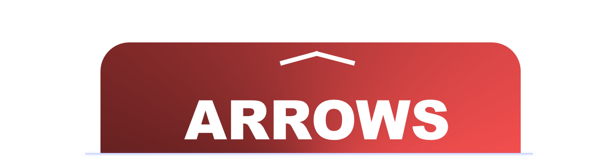
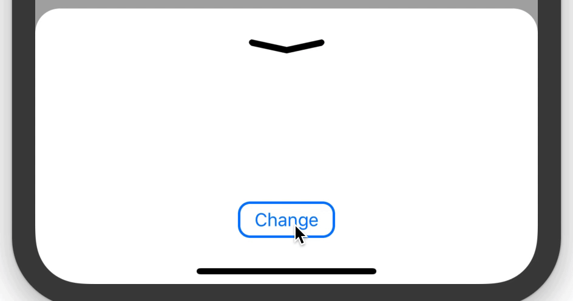

<p align="center">
  
</p>

[](https://github.com/Carthage/Carthage)
[](https://github.com/antoniocasero/Panels)
[](https://developer.apple.com/iphone/index.action)
[](https://developer.apple.com/swift)

[](http://twitter.com/acaserop)

Arrows is an animated custom view to represent three different arrow states: `up/down/middle`

<p align="center">
    
</p>


## Usage

Just need to set `ArrowView` in the class you want to be painted with the arrow indicator in IB.
Or directly instantiate the class `ArrowView` in code. It is based on UIBezierPath, so the dimensions are defined by the view frame, don't worry about the resolution it will look perfect.

In your ViewController, you can change the state of the arrow using `update` function

```swift
class YourViewController: UIViewController {
    @IBOutlet weak var arrow: ArrowPanel!

    override func viewDidLoad() {
        super.viewDidLoad()
        // .up, .down, .middle
        arrow.update(to: .middle, animated: true)
    }
}
```

You can find more options in `ArrowView`
```swift
    ///  Get the current position
    fileprivate(set) var arrowPosition: Position = .middle

    /// Animation duration between arrow states (accessible from IB)
    @IBInspectable open var arrowAnimationDuration: Double = 0.30

    /// Set arrow color (accessible from IB)
    @IBInspectable open var arrowColor: UIColor = .black
```

The perfect companion for `Arrows` is [Panels](https://github.com/antoniocasero/Panels), check it out! ✨

<p align="center">
    
</p>


## Installation

### CocoaPods
Add the line `pod "Arrows"` to your `Podfile`

### Carthage
Add the line `github "antoniocasero/Arrows"` to your `Cartfile`

## Author
Project created by Antonio Casero ([@acaserop](https://twitter.com/acaserop) on Twitter).

### Credits

[UI Sketch](https://www.sketchappsources.com/free-source/3599-vpn-app-design-sketch-freebie-resource.html)
